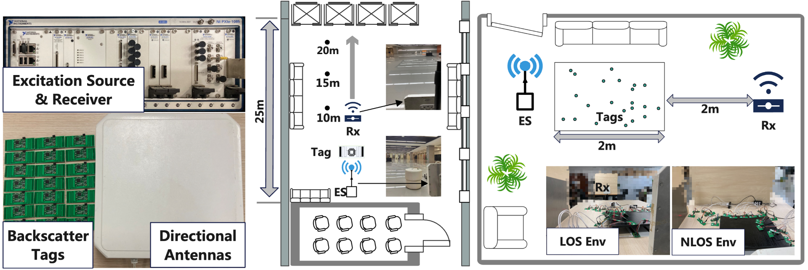

I am a final-year PhD candidate in the School of Computer Science and Technology at the University of Science and Technology of China (USTC), Hefei, Anhui, 230026, P.R. China. My supervisor is Prof. Xiang Yang Li (ACM/IEEE Fellow). My research interests span across passive internet of things, backscatter communication, and mobile/wireless sensing. My work has been published/accepted in leading conferences and journals, including ACM MobiSys, IEEE INFOCOM, IEEE IWQoS, and ACM TOSN.

EDUCATION EXPERIENCE
======
- **2020.06 - present**: School of Computer Science and Technology at University of Science and Technology of China(USTC), PhD.
Supervisor: Xiang-Yang Li (ACM / IEEE Fellow) and Yubo Yan.

- **2016.09 - 2020.06**: School of Computer Science and Technology at Nanjing University of Aeronautics and Astronautics(NUAA), Bachelor.
Major: Software Engineering (Overall GPA: 4.3/5 Rank: 1st/101)

PUBLICATIONS
======
- "MegaScatter: Large-Scale and Ubiquitous Backscatter Network via Multi-Domain Fusion".
  - **Shanyue Wang**,  Yuxin Ding, Yubo Yan, Feiyu Han, Dawei Yan, Panlong Yang. 
  - IEEE Conference on Computer Communications (INFOCOM 2025)
- [“MultiRider: Enabling Multi-Tag Concurrent OFDM Backscatter by Taming In-band Interferences”](https://dl.acm.org/doi/abs/10.1145/3643832.3661862) .
  - **Shanyue Wang**, Yubo Yan, Feiyu Han, Yuxin Ding, Panlong Yang, Xiang-Yang Li. 
  - The 22nd ACM International Conference on Mobile Systems, Applications, and Services (MobiSys 2024).
- [“Slickscatter: Help WiFi Backscatter Signal Survive from the Unknown Interferences”](https://ieeexplore.ieee.org/abstract/document/10682943?casa_token=vIERyBbY2HkAAAAA:kimKI9iyahEVs1uaI-tudMcBXOf2sqBr92iNQ6ih0Hnr0nH5nk_Pbu9hKvDVBqXS0AtfcKHADDI).
  - **Shanyue Wang**, Feiyu Han, Yubo Yan, Yuxin Ding, Panlong Yang, Xiang-Yang Li. 
  - IEEE/ACM International Symposium on Quality of Service (IWQoS 2024).
- [“Spray: A Spectrum-efficient and Agile Concurrent Backscatter System”](https://dl.acm.org/doi/abs/10.1145/3638051).
  - **Shanyue Wang**, Yubo Yan, Yujie Chen, Panlong Yang, Xiang-Yang Li. 
  - ACM Transactions on Sensor Networks (TOSN 2024).
- [“Enhanced Capacity for Multi-Tag Concurrent Backscatter Communication Systems under Spectrum Constraints”](https://crad.ict.ac.cn/en/article/doi/10.7544/issn1000-1239.202440401).
  - Xiang-Yang Li, **Shanyue Wang**, Chi Zhang, Yubo Yan, Haisheng Tan. 
  -  Journal of Computer Research and Development (JCRD 2024)
- [“VideoBack: High Quality Video Backscatter with Ambient WiFi”](https://ieeexplore.ieee.org/abstract/document/10476085).
  - Yuxin Ding, **Shanyue Wang**, Yubo Yan, Panlong Yang. 
  - International Conference on Parallel and Distributed Systems (ICPADS 2023).
-  "An Image Recovery Method for Non-Retransmission Backscatter Communication".
   -  Qinmeng Du, **Shanyue Wang**, Xiang Cui, Yachen Mao, Xiangyang Li.
   -  IEEE International Conference on Mobility, Sensing and Networking (MSN 2024).
- [“Stabilizing Dynamic Backscatter for Swift and Accurate Object Tracking”](https://dl.acm.org/doi/abs/10.1145/3687479).
  - Yachen Mao, Yubo Yan, **Shanyue Wang**, Xiangyang Li. 
  - ACM Transactions on Sensor Networks (TOSN 2024).
- [“WiB-MAC: Collision-Avoidance Multiple Access for Wi-Fi Backscatter Networks”](https://ieeexplore.ieee.org/abstract/document/10682888?casa_token=t-iflYuCHN8AAAAA:dW-q8r8Oe61t9Vy0-92hOcUA3WuehNC5FTaIpL0b4wh047a6aqzEcvvX0i_YPCtMtVkP_8lGcZk).
  - Yujie Chen, Yuxin Ding, **Shanyue Wang**, Yubo Yan. 
  - IEEE/ACM International Symposium on Quality of Service (IWQoS 2024).
-  [“STABack: Making Dynamic Backscattering Stable for Fast and Accurate Object Tracking”](https://ieeexplore.ieee.org/abstract/document/10188790?casa_token=0tFbrd88icIAAAAA:zOXFPuMSC515423od0PmglPzAEPBG6sO_u14VRZVgScOzMjvWMeoBF68hAA27C6UMJ2Ccd8upG0).
   -  Yachen Mao, Panlong Yang, **Shanyue Wang**, Yubo Yan.
   -  IEEE/ACM International Symposium on Quality of Service (IWQoS 2023).
-  [“A Framework for Adaptive Adjustment in BLE-Based Low Power IoT Vision”](https://ieeexplore.ieee.org/abstract/document/10819368?casa_token=M2waCU-oVgQAAAAA:wNGrXCv7aN0ktVqhRGxIaoXILtpqHQ-mx2w1SdEviRTarqY1WWfdp5I1wX-AUKYZ1z4_x8qjFhg).
   -  Xiang Cui, Yachen Mao, Qinmeng Du, **Shanyue Wang**, Yubo Yan, Hao Zhou, Xiangyang Li.
   -  IEEE Internet of Things Journal (IOTJ 2024).
-  [“Survey on Low Power Sensing of AloT”](https://crad.ict.ac.cn/en/article/doi/10.7544/issn1000-1239.202440396). 
   -  Xiang-Yang Li, Fei Shang, Yubo Yan, **Shanyue Wang**, Feiyu Han, Guoxuan Chi, Zheng Yang, Xiaojiang Chen.
   -  Journal of Computer Research and Development (JCRD 2024).
 

RESEARCH PLATFORMS
======

1. **Ultra-Low-Power Massive IoT Platform**

<!--  -->

   - An optimal spectrum planning strategy based on linear programming enables 30 tags to communicate concurrently in a 630kHz band with 305kbps throughput. A conflict-tolerant priority scheduling technique supports 96-tag cooperation.
   - For high-bandwidth WiFi backscatter signals, partial spectrum overlap and interference cancellation enable concurrent communication of 10 tags in the 2.4GHz band.
   - Design large-scale backscatter communication protocols, combine spatial pseudo-orthogonality and OFDMA techniques to enable simulation of 9,600 tags concurrency.
  
  

    <video width="320" height="240" controls muted>
        <source src="../images/SprayDemo.mp4" type="video/mp4">
    </video>
  

1. **Robust Battery-Free Sensors Platform**
    
   - **Wide-Range Passive Universal Sensing Platform**: Utilizing MOSFET transistors combined with an ultra-low-power square wave reference circuit to establish a stable relationship between RF signal parameters and sensor voltage. The prototype operates within 30 µW, with an average measurement error of less than 3%.
   - **Passive Image Signal Transmission**: Incorporating Vision Transformer-based image reconstruction algorithms to reduce transmission load by 70%.
   - **Robust Sensing Platform Based on Ambient WiFi Backscatter**: To mitigate low-frequency interference caused by drastic signal amplitude variations during tag movement, an energy balancing and dynamic demodulation algorithm is proposed, reducing the BER by 0.38.
   - **Robust Sensing Platform Based on Ambient WiFi Backscatter**: Restores the original frequency band using WiFi pilot signals for single-receiver demodulation and recovers corrupted signals by detecting interference-free subcarriers, reducing FER by up to 50%.
  
    

      <video width="320" height="240" controls muted>
          <source src="../images/Camera.mp4" type="video/mp4">
      </video>
      <video width="320" height="240" controls muted>
          <source src="../images/Staback_Demo.mp4" type="video/mp4">
      </video>
  

AWARDS
======
- **First-Class Academic Scholarship**, University of Science and Technology of China (USTC), 2020, 2024  
- **Outstanding Graduate**, Nanjing University of Aeronautics and Astronautics (NUAA), 2020  
- **National Scholarship (Undergraduate)**, Ministry of Education of China, 2018  
- **First-Class Outstanding Student Scholarship**, NUAA, 2017–2020  
- **First-Class Academic Scholarship**, NUAA, 2017–2020  
- **Merit Student**, NUAA, 2017–2020  
- **Top 100 Outstanding Young Students**, NUAA, 2019  
- **First Prize**, 10th Lanqiao Cup National Software and Information Technology Professional Competition (C/C++ Programming, Undergraduate A Group, Jiangsu Province), Ministry of Industry and Information Technology, 2019  
- **Second Prize**, 9th Lanqiao Cup National Software and Information Technology Professional Competition (C/C++ Programming, Undergraduate A Group, Jiangsu Province), Ministry of Industry and Information Technology, 2018  

SKILLS
======
- **Programming Languages**: C/C++, MATLAB, Python, GNU Radio, LabVIEW, Java, Verilog.
- **Instrument usage**: Universal Software Radio Peripheral (USRP), Millimeter wave radar, Vector Network Analyzers (VNA), RFID, PyTorch, AEDT HFSS.
- **Circuit Design & Embedded Development**: Design Data, analog, and RF circuits and experience developing firmware and hardware solutions using MSP430, STM32, CC13xx, CC2650, and ESP32 microcontroller platforms.

TA Experience
======
- [Computer Systems Laboratory and Course Design](https://github.com/jinhang1997/NUAA-PA2019-lecture/tree/master) (2019, 2020 NUAA) 
  - Writing the document of PA [2.1](https://github.com/jinhang1997/NUAA-PA2019-lecture/blob/master/pa2/2.1.md) [2.2](https://github.com/jinhang1997/NUAA-PA2019-lecture/blob/master/pa2/2.2.md) [4.1](https://github.com/jinhang1997/NUAA-PA2019-lecture/blob/master/pa4/4.1.md)
  - Preparing for the lectures of PA2, PA4 
- Computer Organization and Architecture (2020, 2021, USTC)
- Science and Society (2023, 2024, USTC)